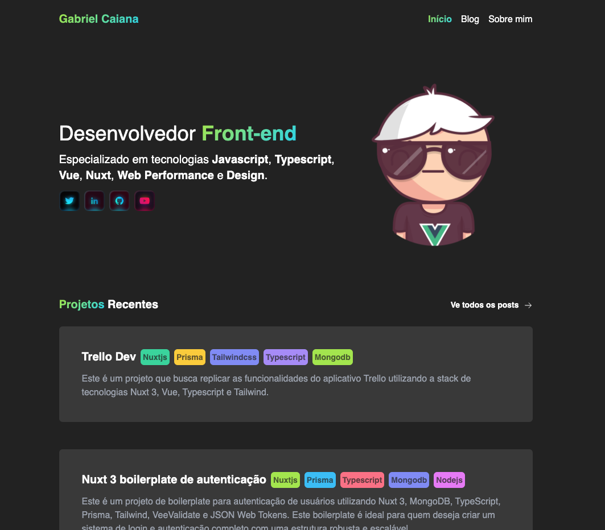

# Gabriel Caiana Codes

 <br />

This is my website that I build on Nuxt 3. I use it as my playground to try new things and have fun. Feel free to give it a feel and copy anything you like as the code is open source; so if it helps you, great. All content is written in markdown using Nuxt Content v2 and it makes adding new posts, videos etc very easy.

> technologies used

- [Nuxt 3](https://nuxt.com/v3)  - The Intuitive Vue Framework
- [Nuxt Content 2](https://content.nuxtjs.org/)  - Empower your NuxtJS application with the @nuxt/content
- [Vitest](https://vitest.dev/)  - Vitest Blazing Fast Unit Test Framework
- [Algolia](https://www.algolia.com/pt-br/)  -  Algolia is a hosted search engine
- [Tailwind](https://tailwindcss.com/)  -  Rapidly build modern websites without ever leaving your HTML.

## Setup

Make sure to install the dependencies:

````bash
# yarn
yarn install

## Development Server

Start the development server on http://localhost:3000

```bash
yarn dev
````

## Production

Build the application for production:

```bash
yarn build
```

Locally preview production build:

```bash
yarn preview
```
